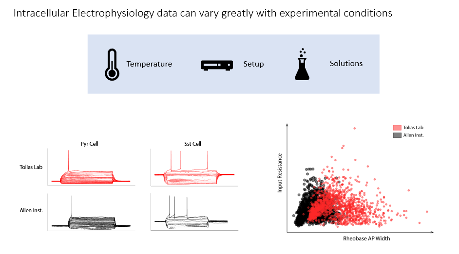

# patchOTDA
## What is this?
The aim of this package is to faciltate integration of patchclamp electrophysiology datasets. Due to the sensitivity of patchclamp electrophysiological recordings to a variaty of different extraneous variables, for example tempurature, solution, region etc.
  

patchOTDA is a small python package that wraps several optimal transport based domain adaptation packages. The package aims to help intermediate users integrate two datasets by following simple OOP convetions.  
 
End users are encouraged to check out the streamlit app -> https://patchotda.streamlit.app/ which allows you to integrate your dataset with a reference dataset from the allen institute.

## Quickstart
### Install

